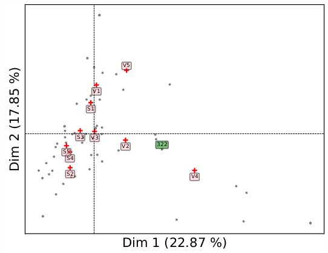
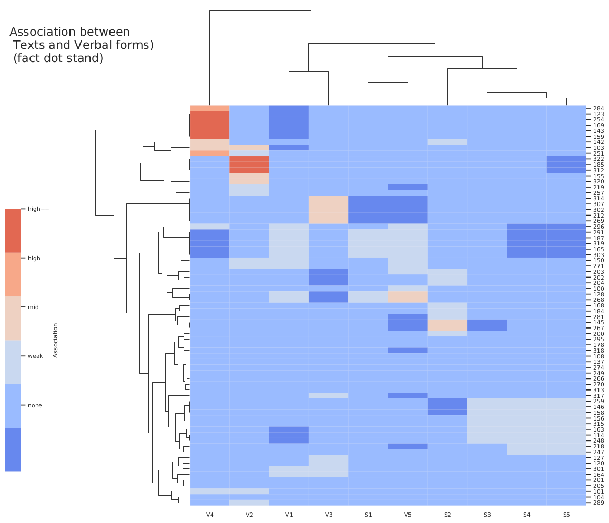
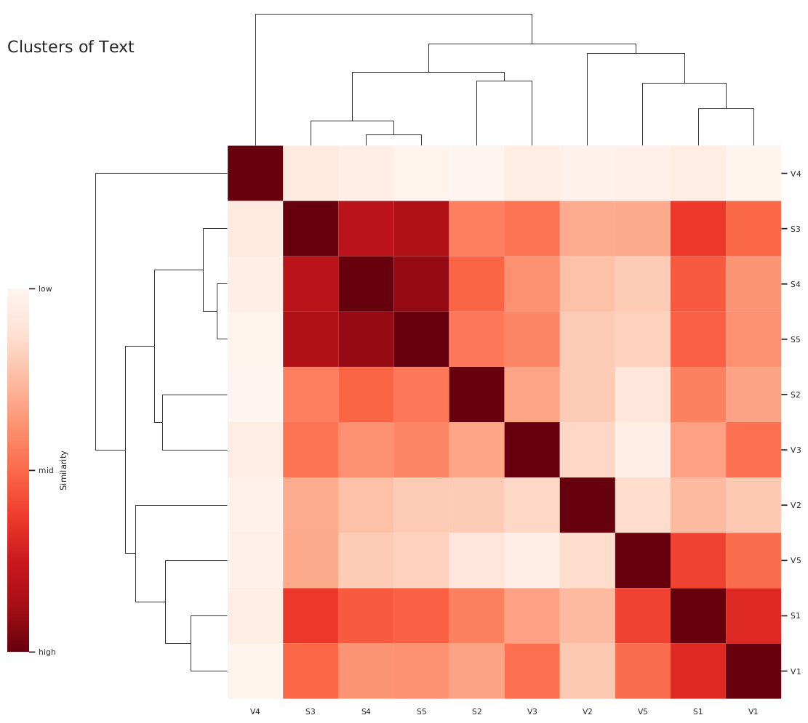
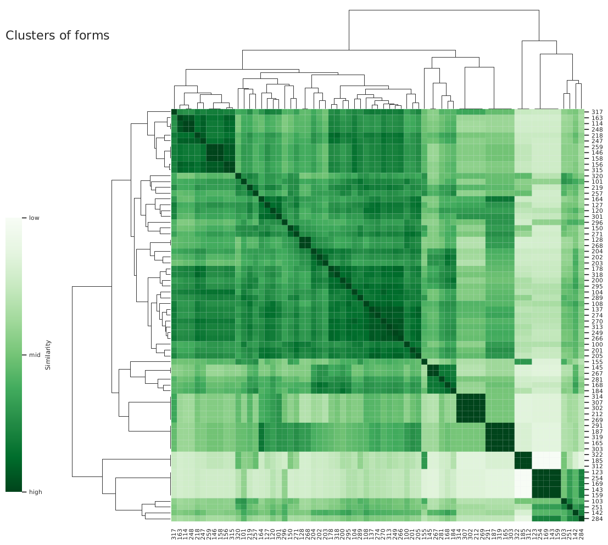

# Free Correspondence Analysis Python Software
# Suitable for Users from any Disciplines

## Description
Perform standard correspondence analysis of two categorical variables (code module `ca.py` in the folder Methods/).

Code can be used to perform correspondence analysis on any dataset that can be transformed into a pandas DataFrame (see the code `ca.py` in the folder Methods/).

The method `mcmca.py` can be used for correspondence analysis of dataset that could be assumed to be generated from a Markov Chain Model.

## Specific Project
Project Ef5-4: ["The evolution of Ancient Egyptian - Quantitative and Non- Quantitative Mathematical Linguistics"](https://mathplus.de/research-2/emerging-fields/emerging-field-5-concept-of-change-in-historical-processes/ef5-4/).

Institutions: ZIB (Zuse Institute Berlin) & MATH+ (Berlin Mathematics Research Center).

## Software requirements
python version: 3.7 or +

packages: numpy, pandas, matplotlib, matplotlib.pyplot, matplotlib.backends.backend_pdf, scipy, scipy.stats, seaborn.

You can also get all these using conda by creating a new environment with the spec file `myPy3_spec.txt` (for a guidance, click [here](https://conda.io/projects/conda/en/latest/user-guide/tasks/manage-environments.html))
## Usage requirement
See official publication link [here](https://opus4.kobv.de/opus4-zib/frontdoor/index/index/docId/8257)

## Code Execution
### Users with little to no background in python 
`Helper.py`: performs one CA analysis (in this specific project: text vs. grammatical form) 

Please enter all the inputs by following the corresponding questions/decriptions.

`implementation.py` is required to obtain the CA figures.

### Users with a moderate background in python
`implementation.py` can be used to modify the default figure parameter settings. For further modifications, see all the codes in folder Methods/

### Notes for all Users 
If the dataset is already a contingency table, then the parameter `isCont` must be given as `True` and the table should be transformed into a panda dataframe (lines 21 -- 31 of `implementation.py`)

## Supported Data type (if not a contingency table)
Excel file. In our specific project, datafile contains numerical coding of texts in Égyptien de Tradition, each single data consisting of a ten digits number encoding for the grammatical structure of a sentence (files can be downloaded [here](https://www.zib.de/ext-data/correspondence/)).

You can also use your own python function to clean your dataset instead of the function `Cleaned_Data` in `implementation.py` line 9.
## Results
Figures/ folder is the default location of figure outputs.

## Sample Figures
Click [here](https://github.com/AlexiaNomena/Correspondence_Analysis_Made_Easy/blob/main/Figures/CA/CA_text_Vb_F1_to_F5_all.pdf) for a higher resolution

### Standard CA figure and a few statistics
Visualising the usual correspondence analysis results

  

### Association clustermap
Visualising the strenght of the association between the variables 

Identify similar clusters (similarity in the strenght of the associations)

  

### Variable clustermap
Identify similar clusters of variables (chi-square similarity)
 

  

  

